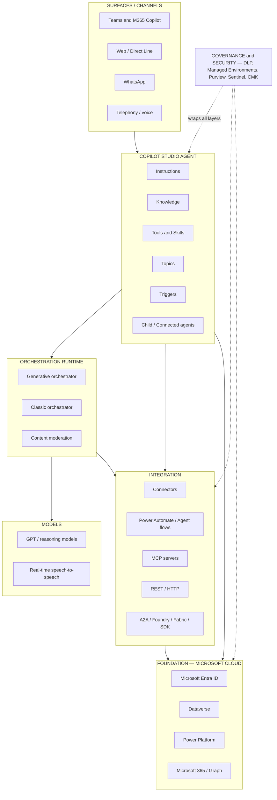
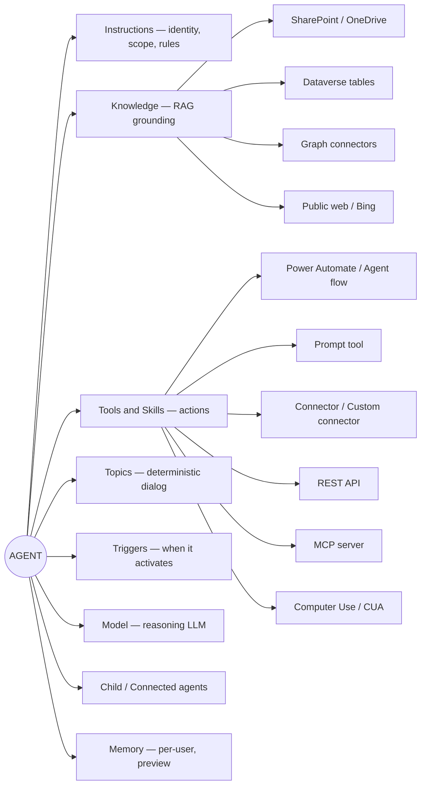
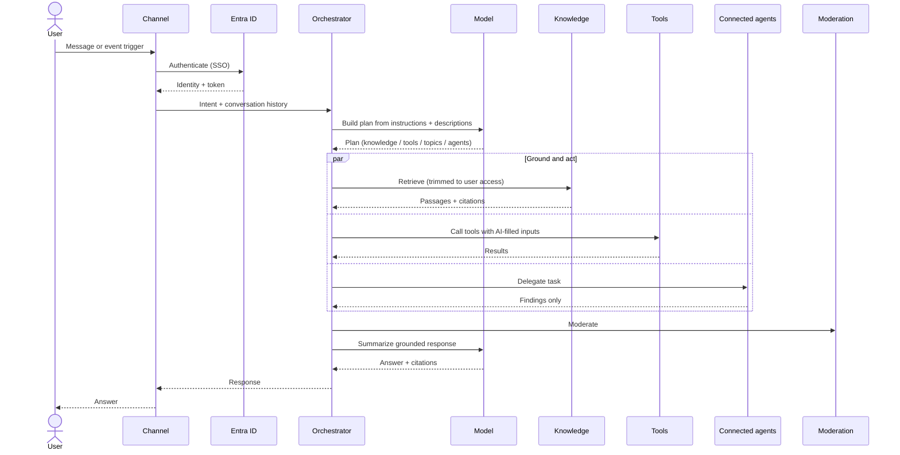
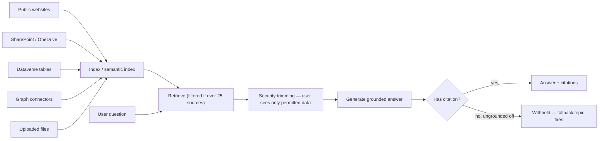
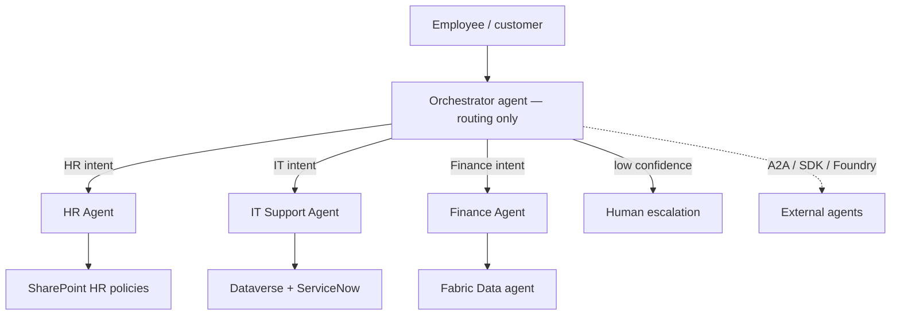
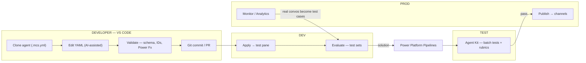
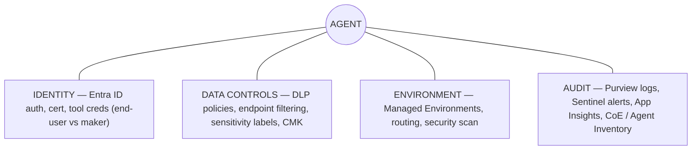
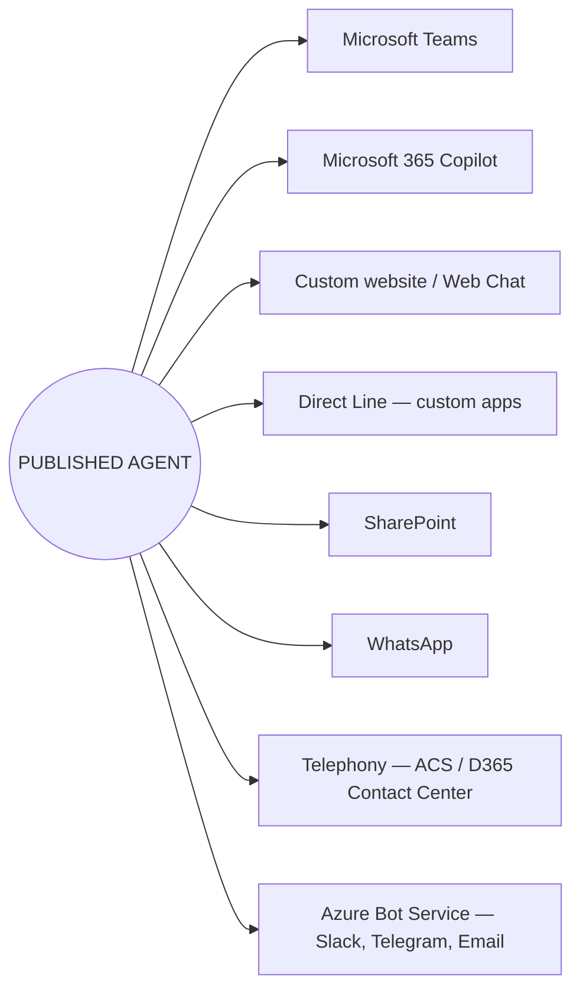
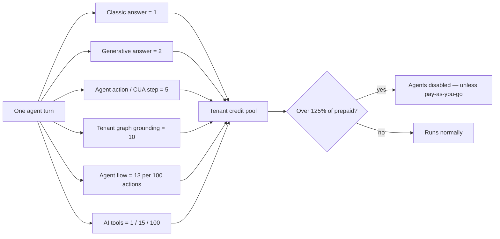

# Copilot Studio — Enterprise Architecture (Mermaid)

A visual map of how Copilot Studio agents are **built**, how they **run**, and how an enterprise **wraps** identity, governance, ALM, and cost around them. Nine schematic plates, read as a set.

> Compiled 2026-07-23 · Source: Microsoft Learn + local knowledge base · Scope: classic + generative orchestration.
> Renders automatically on GitHub and in VS Code Markdown preview with a Mermaid extension. Companion to the styled page `copilot-studio-architecture.html` and to `knowledge-base/reference/architecture-diagrams.md`.

**Three ways to read the plates**

| Phase | Meaning | Plates |
|-------|---------|--------|
| **Build time** | Author components as YAML, version in Git, promote through environments | 02, 06 |
| **Run time** | The orchestrator plans each turn — grounds, calls tools, delegates, moderates, summarizes | 03, 04 |
| **Enterprise wrap** | Identity, DLP, managed environments, monitoring, multi-agent, channels, cost | 01, 05, 07–09 |

---

## Plate 01 — The enterprise platform stack

**Read this as layers.** Everything rests on Entra ID (identity), Dataverse (storage), and Power Platform (governance). Governance isn't a layer — it wraps all of them.

---

## Plate 02 — Anatomy of a single agent

**Read this as a parts list.** An agent is these components. Under generative orchestration the planner routes across them using their **names and descriptions** — which is why descriptions are the real source code.

---

## Plate 03 — Runtime flow (generative orchestration)

**Read this as one user turn.** The planner reads instructions + descriptions, builds a plan, grounds and acts in parallel, moderates, then summarizes a cited answer. The activity map exposes this path when testing.

> **Cost note:** the planner reasons every turn, so generative orchestration costs more credits than a classic topic-trigger match. Use classic for high-volume, predictable intents.

---

## Plate 04 — Knowledge & RAG pipeline

**Read this as grounding.** Sources are indexed, retrieved (description-filtered past 25 sources), **security-trimmed to the asking user**, then generated. No citation + ungrounded off = the answer is withheld.

---

## Plate 05 — Multi-agent topology (hub & spoke)

**Read this as delegation.** A lean orchestrator routes to independently-owned domain agents. Only the orchestrator talks to the user; sub-agents return findings. Split past ~30–40 combined choices.

> **Trade-off:** each hop adds latency and credits. Keep the parent a router, not an executor — don't duplicate sub-agent capability in the parent.

---

## Plate 06 — ALM & the code-first dev loop

**Read this as the pipeline.** Clone to VS Code, edit YAML, validate, commit. Apply to DEV to test; gate promotion on test sets via solutions + pipelines. **Apply is not Publish.**

> **Per-environment:** DLP policies, connection references, and environment variables rebind on each hop — solutions and pipelines handle this.

---

## Plate 07 — Governance & security layers

**Read this as the wrap.** Four control planes surround every agent: identity, data controls, environment governance, and audit/monitoring.

---

## Plate 08 — Channels & surfaces

**Read this as reach.** One published agent, many surfaces — each renders differently (Teams caps cards/citations; telephony is voice-only).

---

## Plate 09 — Cost model (Copilot Credits)

**Read this as the meter.** Each turn can stack meters; all draw on one tenant pool. Cross 125% of prepaid capacity and agents are disabled — unless the environment is pay-as-you-go.

---

### How to read the whole set together
1. **Build time** (plates 02, 06): author components as YAML, version in Git, promote via solutions/pipelines.
2. **Run time** (plates 03, 04): the orchestrator plans per turn, grounds on knowledge, calls tools, delegates, moderates, summarizes.
3. **Enterprise wrap** (plates 01, 05, 07–09): identity, DLP, managed environments, monitoring, multi-agent topology, channels, and cost governance surround everything.

Deep-dive references live in [knowledge-base/](knowledge-base/): fundamentals, generative orchestration, knowledge, governance/DLP, licensing/credits, ALM, and multi-agent patterns.
