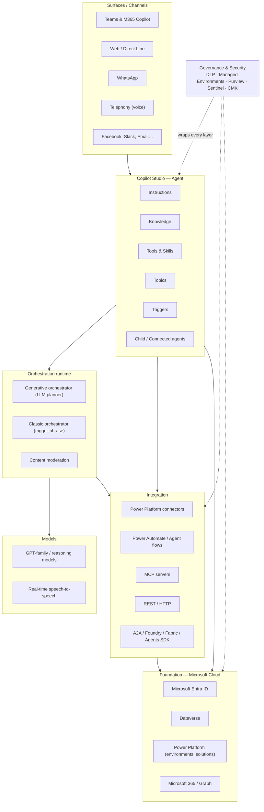
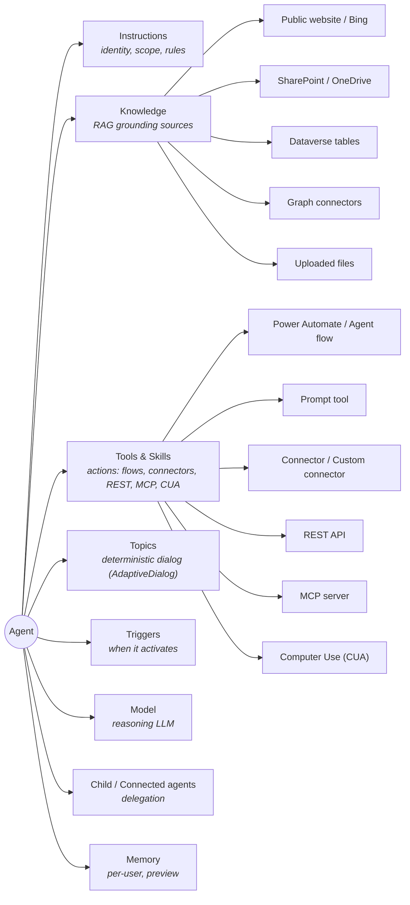
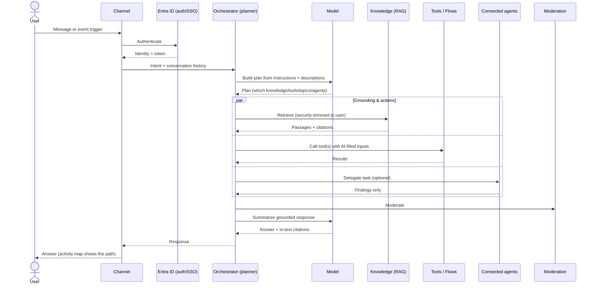
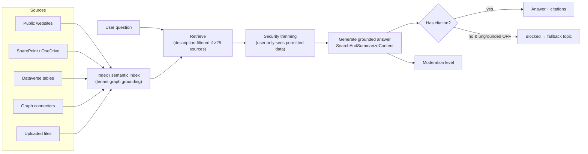
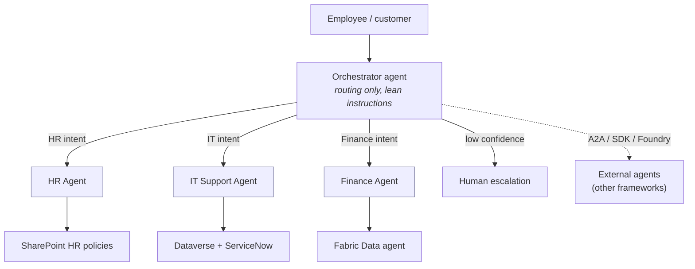
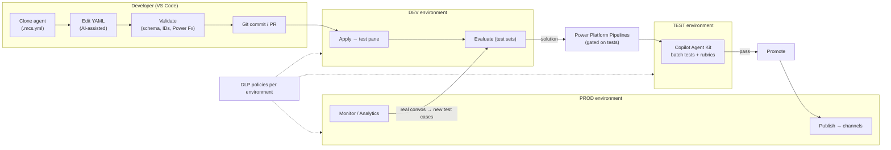
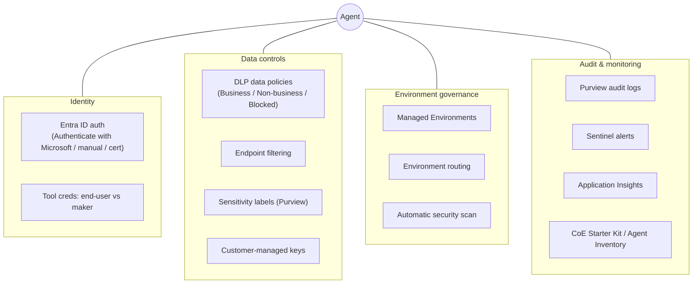
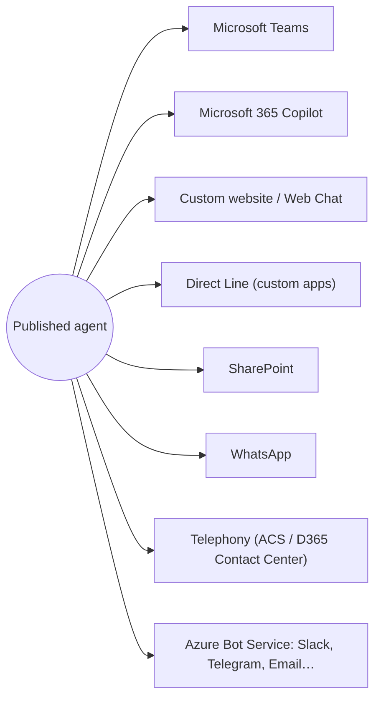
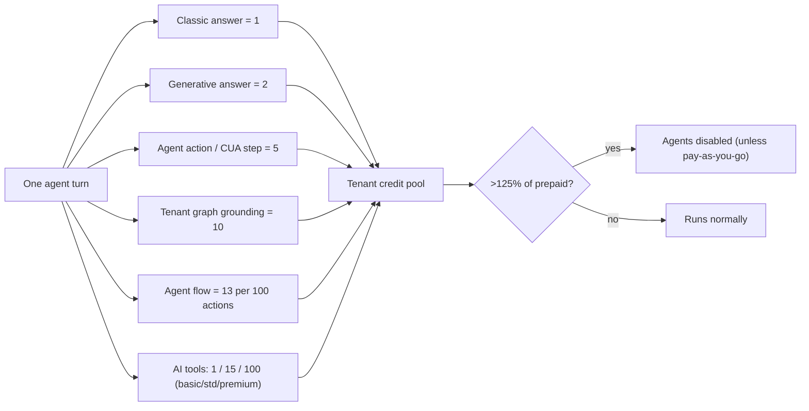

# Reference — Copilot Studio Architecture (Mermaid diagrams)

Visual model of Copilot Studio for **enterprise** use. Each diagram has a short "read this as…" note. (Diagrams render on GitHub, in an Artifact, or in VS Code with a Mermaid preview extension.)

---

## 1. The enterprise platform stack (layers)

How the pieces sit on top of Microsoft's cloud. Everything an agent does is built on **Entra ID (identity)**, **Dataverse (storage)**, and **Power Platform (governance/ALM)**.

---

## 2. Anatomy of a single agent

What an "agent" actually is. The orchestrator routes across these components using their **names + descriptions**.

---

## 3. Runtime request flow (generative orchestration)

The critical path for **one user turn**. This is why "descriptions are the real source code" — the planner selects components from them.

---

## 4. Knowledge / RAG pipeline

How grounding works, and where enterprise controls (auth trimming, semantic index, moderation) sit.

---

## 5. Multi-agent enterprise topology (hub-and-spoke)

The pattern most enterprises land on: a lean **orchestrator** routing to independently-owned **domain agents**. Keep the parent a router, not an executor.

> Rule of thumb: split into connected agents past **~30–40 combined choices** or when teams own domains separately. Each hop adds latency + credits. Single-response principle: **only the orchestrator talks to the user**.

---

## 6. Enterprise ALM + code-first dev loop

How agents move from a developer's machine to production **safely and repeatably** — the framework we're building toward.

> **Apply ≠ Publish.** Apply updates the live definition for testing; Publish exposes it on channels. Connection references & environment variables rebind per environment (solutions/pipelines handle this).

---

## 7. Governance & security layers

The cross-cutting controls an enterprise wraps around every agent.

---

## 8. Channels & surfaces (where users meet the agent)

One published agent, many surfaces — each with different rendering (see limits per channel).

---

## 9. Cost model (Copilot Credits, simplified)

Where credits are consumed — shapes design (classic vs generative, tools, autonomous frequency).

---

## How to read the whole thing together
1. **Build time** (diagrams 2, 6): you author components as YAML, version in Git, promote via solutions/pipelines.
2. **Run time** (diagrams 3, 4): the orchestrator plans per turn, grounds on knowledge, calls tools, delegates to agents, moderates, and summarizes.
3. **Enterprise wrap** (diagrams 1, 5, 7, 8, 9): identity, DLP, managed environments, monitoring, multi-agent topology, channels, and cost governance surround everything.

Cross-references: [../01-copilot-studio-fundamentals.md](../01-copilot-studio-fundamentals.md) · [generative-orchestration.md](generative-orchestration.md) · [knowledge.md](knowledge.md) · [governance-security-dlp.md](governance-security-dlp.md) · [licensing-and-credits.md](licensing-and-credits.md) · [../10-alm-publishing-testing.md](../10-alm-publishing-testing.md) · [../guidance/multi-agent-patterns.md](../guidance/multi-agent-patterns.md).
